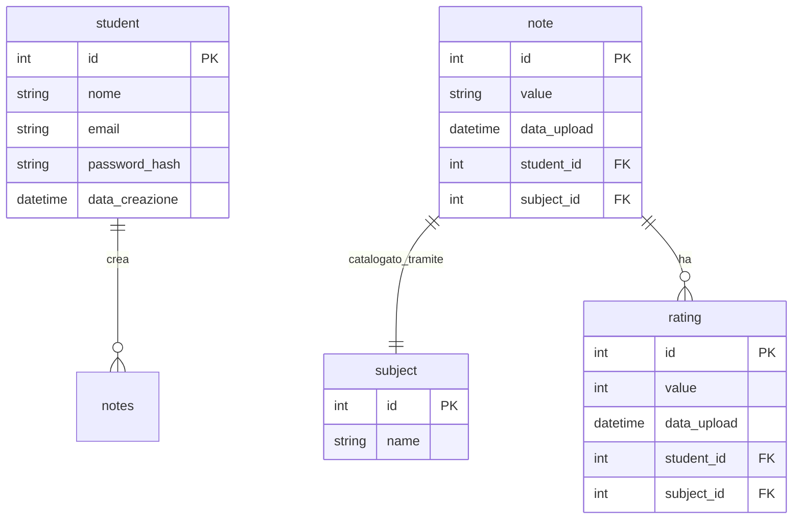
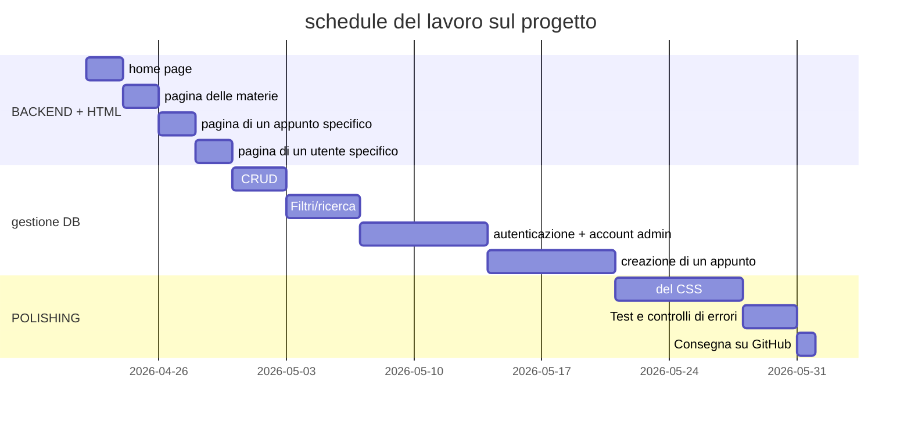

# appunti per scuola
Il progetto project_appunti_scuola nasce dal risolvere il problema di avere unn problema di sincronizzazzione tra i miei vari dispositivi.

### Il problema
Quando mi ritrovo a scuola, prendo degli appunti via file .md e li carico nel mio repository in modo tale che quando torno a casa,

io possa modificarli velocemenete usando il mio PC fisso.

Creando una web app che si salvi automaticamente i vari appunti anche di altre persone, si evita di dover andare a prendere manualmene dalla piattaforma Discord,

dove noi compagni ci scambiamo informazioni e appunti,

---

## struttura del progetto
### HOME PAGE
Di funzioni base si vuole creare una web app che contenga una home page con una lista di materie.

### PAGINA DI UNA SPECIFICA MATERIA
Una volta premuto sulla materia, si spostera' l'utente in un altra pagina che faccia vedere gli appunti di quella materia ordinati per la data di pubblicazione (_sperimentale_: tramite il numero della unita' del libro).

Nella pagina degli appunti ci sara' mostrato solo il titolo e chi lo ha postato e la data (_sperimentale_: gli appunti hanno un rating da 1 a 5, quindi mostrare la media e quante recensioni si hanno fatto).

### PAGINA DI UN APPUNTO
Una volta che si ha premuto sull'appunto, verra' mostrato il contenuto (_sperimentale_: convertire gli .md in html automaticamente dopo la pubblicazione).
---
## OBBIETTIVI GENERALI
- Permettere a un utente di registrarsi e autenticarsi,
- Consentire la creazione, modifica, eliminazione e visualizzazione degli appunti,
- Consentire la ricerca e il filtro delle materie (in caso anche nella pagina di tutti gli appunti),
- Fornire una pagina di profilo dove l'utente vede i propri appunti,
- Permettere a chiunque di scaricare gli appunti o stamparli.

---

## Percorsi del sito
`/` la home,

`/subjects` pagina delle materie,

`/subjects/<int:id>` pagina di tutti gli appunti di una materia specifica,

`/note/<int:id>` pagina di un appunto specifico,

`/students` pagina con tutti gli user,

`/students/<int:id>` pagina di uno studente specifico.

---

## schema ER delle relazioni

## Glossario dei termini
`student`: sono gli studenti che hanno fatto l'accesso,

`note`: e' le informazioni sul file che e' stato creato dallo `student` e contiene anche il file dentro a value,

`subject`: e' la materia e funge da filtro nella ricerca e ordinamento degli appunti,

`rating`: e' una valutazione da 1 a 5 di quanto e' affidabile e robusto un appunto.

---

## Schedule del lavoro sul progetto

